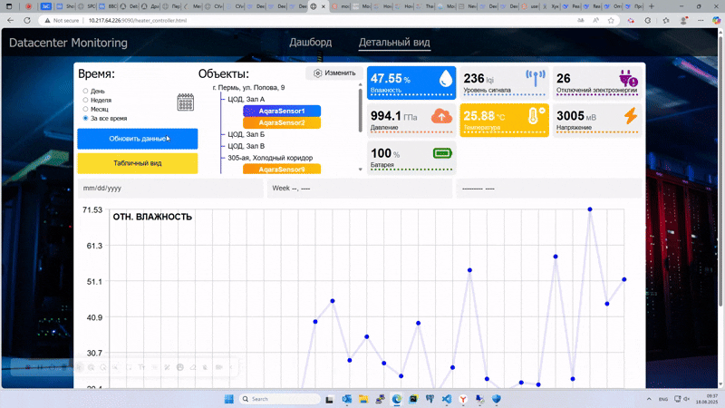
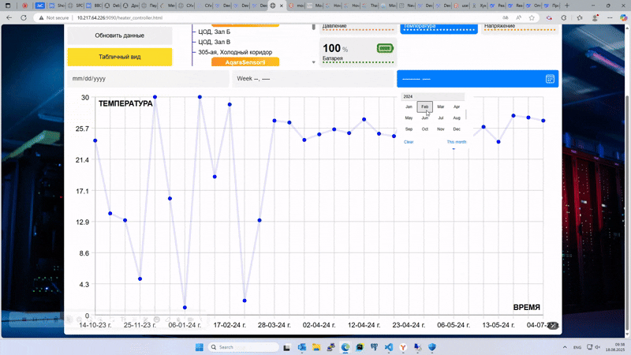
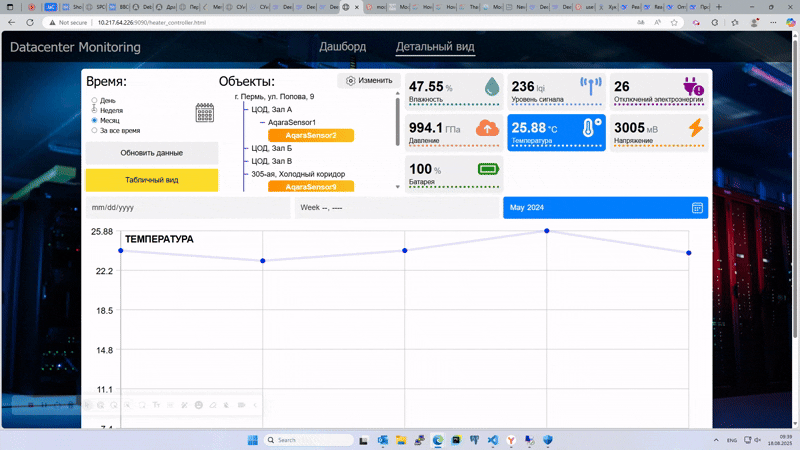
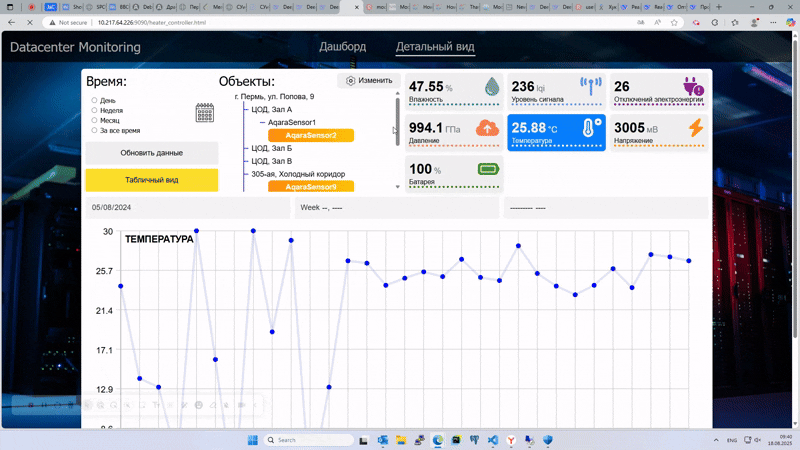
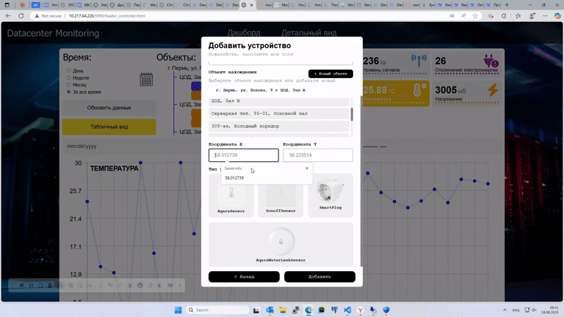

# IoT Dashboard

**Веб-приложение для мониторинга устройств умного дома (Zigbee + IoT)**  

## 📌 О проекте
Система мониторинга умных устройств с использованием MQTT-брокера Mosquitto и кастомного PowerShell-сервера.  

### Возможности:
- **Дашборд с деревом адресов и комнат**  
- **Мониторинг параметров датчиков** (температура, влажность и др.)  
- **SVG-графики изменений показателей** по дням, неделям и месяцам  
- **CRUD-операции** с датчиками и локациями  
- **Второй дашборд с Яндекс.Картами** (точки расположения объектов, статус по цветам: 🟢 нормально, 🟡 выход за пределы нормы, 🔴 отсутствуют данные)  
- **MySQL база данных** для хранения информации  

## 🛠 Технологии
- **Фронтенд**: HTML, CSS (адаптивный дизайн), JavaScript 
- **Бэкенд**: PowerShell (самописный сервер), MySQL  
- **IoT**: Mosquitto MQTT Broker, Zigbee устройства  
- **API**: Яндекс.Карты  

## 📸 Демонстрация
1. Древовидный список локаций и датчиков  
   

2. Отрисовка SVG-графика по параметрам датчиков
   

3. Отрисовка SVG-графика за период (месяц)
   

4. Отрисовка SVG-графика за период (день) 
   

5. Дашборд всех объектов
   

6. Добавление нового устройства
   

7. Удаление устройства
   
